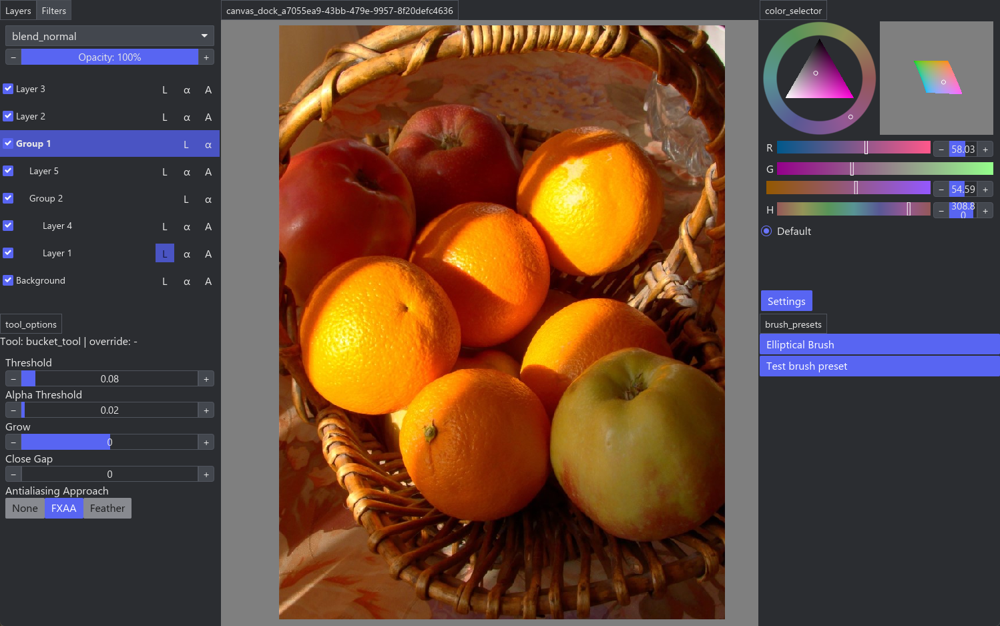
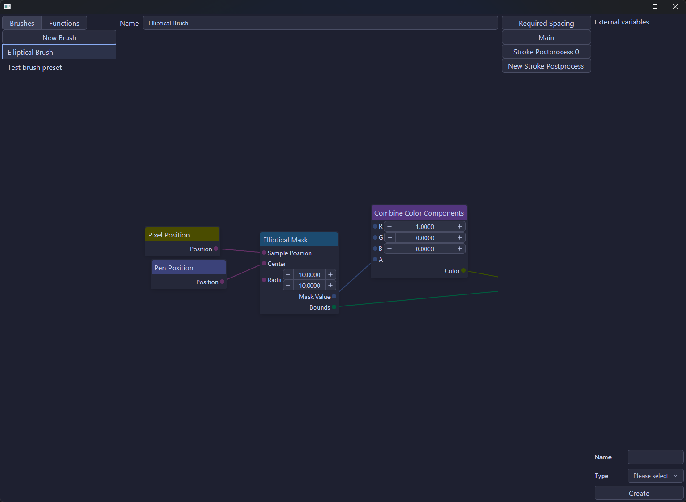

# Cyancia

> [!WARNING]
> This project is still at pre-pre-pre-alpha stage, and is absolutely not intended for production use. It has tons of bugs and incomplete code!

- Cute orange photo by Dariusz Duchiewicz on [Pexels](https://www.pexels.com/photo/bright-basket-of-oranges-and-apples-36492525/)

A GPU powered, programmable, highly customizable and blazing fast digital painting program written in Rust, build with ❤ and passion, and open-source forever under GPL-3.0 License.

# Features

## GPU Based

Commonly, raster image editors are using CPU-based rendering, which is easier for development, but very slow when performing heavy image operations. Thanks to [`wgpu`](https://github.com/gfx-rs/wgpu), developing GPU stuff is much easier than operating with raw graphics APIs, and is much easier for cross-platform support.

## Highly Customizable Brush Engine

Common painting applications uses a fixed brush engine, for example, in Photoshop, you can only customize the brush by adjusting fixed parameters like size and opacity.

However, in Cyancia, you can use shader graph to create arbitrary brush effects. Shader graphs are compiled into shader, which runs on your gpu, so you can do essentially anything you want while keeping the high performance.

## LLM Assisted Contributions

This project is accepting LLM assisted contributions. BUT will absolutely reject any code that is not **reviewed by human**.

## Special Thanks

- [Bevy](https://bevy.org/)
- [Blender](https://www.blender.org/)
- [Krita](https://krita.org/)
- [LINUX DO](https://linux.do/)
- [Zed](https://zed.dev/)

## License

This project is licensed under the GPL-3.0 License. See the [LICENSE](LICENSE) file for details.
